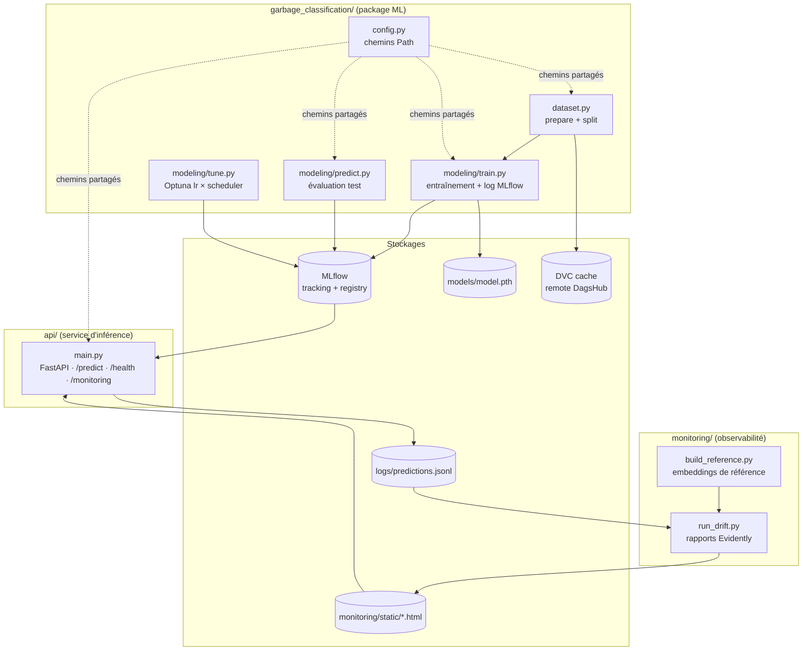
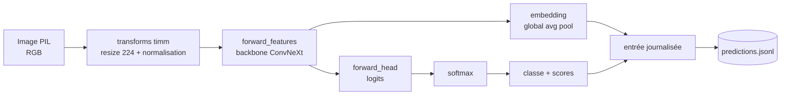

# Blocs de construction

## Diagramme des conteneurs (C4 niveau 2)

## Composants et responsabilités

### Package `garbage_classification/`

| Composant | Responsabilité |
|---|---|
| `config.py` | Source unique des constantes `Path` (`RAW_DATA_DIR`, `PROCESSED_DATA_DIR`, `MODELS_DIR`…). Aucun chemin n'est codé en dur ailleurs. |
| `dataset.py` | Deux étapes DVC : `prepare` (déduplication par hash, intra- et inter-classe) et `split` (organisation en `train/val/test` selon les listes figées). |
| `modeling/train.py` | Entraîne le modèle (chargement timm, fine-tuning), journalise paramètres/métriques/artefact dans MLflow, promeut le `@champion` si la val_acc s'améliore. |
| `modeling/tune.py` | Recherche d'hyperparamètres Optuna (`lr × scheduler`) sur le modèle champion figé. → [ADR-0007](decisions/0007-optuna-grid-search-tuning.md) |
| `modeling/predict.py` | Évalue le modèle sur le jeu de test, produit `eval_metrics.json` et la matrice de confusion. |

### Service `api/`

| Composant | Responsabilité |
|---|---|
| `main.py` | Application FastAPI. Charge `models:/garbage-classifier@champion` au démarrage (`lifespan`), expose `/predict`, `/health` et `/monitoring` (route documentée qui redirige vers le dashboard de drift servi en statique). Journalise chaque prédiction (classe, confiance, embedding, propriétés image) dans `logs/predictions.jsonl`. |

### Module `monitoring/`

| Composant | Responsabilité |
|---|---|
| `build_reference.py` | Pré-calcule la distribution de référence (embeddings + propriétés image du jeu d'entraînement) dans `reference.parquet`. |
| `run_drift.py` | Compare la production (`predictions.jsonl`) à la référence, génère deux rapports HTML Evidently dans `monitoring/static/`. → [ADR-0006](decisions/0006-evidently-drift-monitoring.md) |

## Inférence — composant interne de `/predict`

La route `/predict` enchaîne, en une seule passe du backbone, l'extraction de l'embedding
(pour le monitoring de drift) et le calcul des logits (pour la prédiction) :

!!! note "Réutilisation du backbone"
    `forward_features` est appelé **une seule fois** : l'embedding (moyenne spatiale) et les
    logits (`forward_head`) en sont dérivés sans recalcul. Cela donne « gratuitement » le
    vecteur d'embedding nécessaire à la détection de drift d'embeddings.
