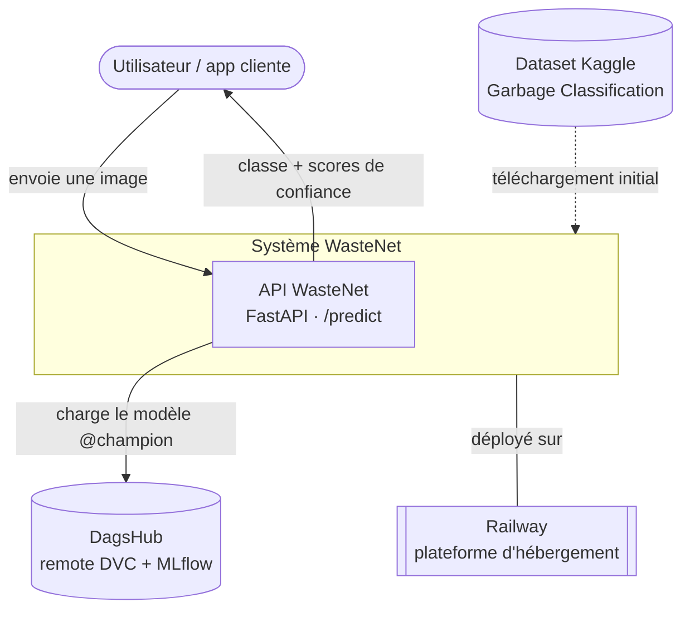

# Contexte

## Objectif

WasteNet fournit une **API de classification d'images de déchets**. Un utilisateur (ou une
application cliente) envoie une photo, et le système renvoie la catégorie de déchet prédite
avec un score de confiance. L'objectif pédagogique est de mettre en œuvre une **chaîne MLOps
complète** : versioning des données, suivi d'expériences, déploiement et monitoring.

### Tâche d'apprentissage

- **Type** : classification d'images supervisée, 6 classes.
- **Classes** : `cardboard`, `glass`, `metal`, `paper`, `plastic`, `trash`.
- **Ordre des classes du modèle** : alphabétique (`ImageFolder` PyTorch →
  cardboard=0, glass=1, metal=2, paper=3, plastic=4, trash=5).

### Dataset

- **Source** : [Garbage Classification — Kaggle](https://www.kaggle.com/datasets/asdasdasasdas/garbage-classification)
  (dérivé de TrashNet).
- **Volume** : ~2 527 images après déduplication.
- **Splits** : train/val/test **prédéfinis** (fichiers `data/raw/one-indexed-files-notrash_*.txt`),
  garantissant une comparaison reproductible entre expériences.

## Diagramme de contexte (C4 niveau 1)

## Acteurs et systèmes externes

| Élément | Rôle |
|---|---|
| **Utilisateur / app cliente** | Envoie une image à `/predict`, reçoit la prédiction. |
| **API WasteNet** | Cœur du système : sert le modèle champion et journalise les prédictions. |
| **Dataset Kaggle** | Source initiale des données d'entraînement (téléchargée une fois). |
| **DagsHub** | Stockage distant : remote DVC (données/modèles) **et** serveur de suivi MLflow (expériences + registre de modèles). |
| **Railway** | Plateforme cloud d'hébergement du conteneur de l'API. |

## Périmètre

**Inclus** : préparation des données, entraînement/sélection du modèle, service d'inférence,
journalisation des prédictions, détection de drift.

**Hors périmètre** : collecte de nouvelles données en production, ré-entraînement automatique
(les expériences sont lancées manuellement via `dvc repro`), authentification des utilisateurs.

## Exigences qualité principales

| Qualité | Comment elle est adressée |
|---|---|
| **Reproductibilité** | Pipeline DVC + `dvc.lock`, splits figés, seed fixe, suivi MLflow. → [ADR-0002](decisions/0002-dvc-versioning-dagshub.md) |
| **Traçabilité des choix** | Suivi d'expériences MLflow + ADR. → [ADR-0003](decisions/0003-mlflow-tracking-registry.md), [ADR-0008](decisions/0008-methodologie-tuning-incrementale.md) |
| **Légèreté du déploiement** | Modèle tiré du registre au runtime, image Docker CPU. → [ADR-0005](decisions/0005-fastapi-docker-serving.md) |
| **Observabilité** | Journalisation des prédictions + détection de drift Evidently. → [ADR-0006](decisions/0006-evidently-drift-monitoring.md) |
