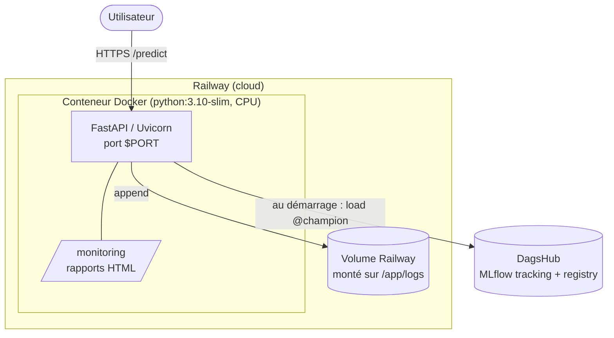
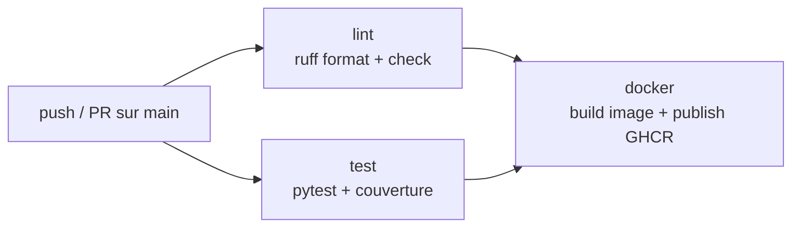

# Déploiement

## Architecture de déploiement

L'API d'inférence est conteneurisée (Docker) et déployée sur **Railway**. Le modèle n'est
**pas embarqué dans l'image** : il est tiré du registre MLflow hébergé par **DagsHub** au
démarrage du conteneur (`lifespan`). L'image reste donc légère et le modèle servi suit
toujours l'alias `@champion`. → [ADR-0005](decisions/0005-fastapi-docker-serving.md)



## Chargement du modèle au runtime

`api/main.py` lit `MLFLOW_TRACKING_URI` et charge `models:/garbage-classifier@champion`. En
l'absence de variable, il retombe sur la base SQLite locale (`sqlite:///mlflow.db`) — pratique
en développement.

```python
# api/main.py (extrait)
tracking_uri = os.getenv("MLFLOW_TRACKING_URI", f"sqlite:///{PROJ_ROOT / 'mlflow.db'}")
model_uri = "models:/garbage-classifier@champion"
```

## Variables d'environnement (Railway)

| Variable | Rôle |
|---|---|
| `MLFLOW_TRACKING_URI` | `https://dagshub.com/MohCw/Wastenet-MLOps.mlflow` |
| `MLFLOW_TRACKING_USERNAME` | Utilisateur DagsHub (lu automatiquement par MLflow) |
| `MLFLOW_TRACKING_PASSWORD` | Token DagsHub (**uniquement** dans les Variables Railway chiffrées) |
| `PORT` | Injecté par Railway au runtime — **ne pas** le définir manuellement |

!!! danger "Secrets"
    Le token DagsHub ne doit **jamais** figurer dans l'image, le dépôt git ou cette
    documentation — seulement dans les variables d'environnement chiffrées de Railway.

## Persistance des logs de prédiction

Un volume Railway est monté sur **`/app/logs`** (et non `/app`, qui écraserait l'application).
Comme `PROJ_ROOT = /app` dans le conteneur, l'API écrit `/app/logs/predictions.jsonl`, qui
survit ainsi aux redéploiements. Le fichier est créé à la **première** prédiction (pas au
démarrage).

## Dockerfile (points clés)

- Base `python:3.10-slim`, **PyTorch CPU** (roues `download.pytorch.org/whl/cpu`).
- Copie uniquement `garbage_classification/`, `api/` et `monitoring/static/` — pas de données,
  pas de `model.pth`, pas de `mlflow.db` (exclus via `.dockerignore`).
- `CMD` en *shell form* pour que `${PORT:-8000}` soit résolu au runtime :
  `uvicorn api.main:app --host 0.0.0.0 --port ${PORT:-8000}`.

## Cartographie des ports

| Service | Port | Contexte |
|---|---|---|
| FastAPI (inférence) | `8000` (ou `$PORT`) | dev **et** prod |
| MLflow UI | `5000` | dev local uniquement |
| Evidently UI | `8001` | dev local uniquement |

!!! info "Monitoring en production"
    En production, il n'y a **pas** de serveur Evidently sur le port 8001. Les rapports de
    drift sont des **fichiers HTML statiques** servis par l'API sous `/monitoring/`.
    Voir [Monitoring](monitoring.md) et [ADR-0006](decisions/0006-evidently-drift-monitoring.md).

## Intégration continue (`.github/workflows/ci.yml`)

Distincte du workflow de documentation, la CI applicative s'exécute à chaque push/PR sur `main` :



| Job | Contenu |
|---|---|
| `lint` | `ruff format --check` + `ruff check`. |
| `test` | `pytest tests/ --cov=garbage_classification --cov=api`. |
| `docker` | Build de l'image puis **publication sur GHCR** (`ghcr.io/<owner>/<repo>`, tags `sha` + `latest`) sur push `main` — build seul sur les PR. Dépend de `lint` + `test`, cache GitHub Actions. |

!!! info "Déploiement gated sur la CI (Railway « Wait for CI »)"
    La CI **publie l'image** sur GHCR. Le **déploiement** sur Railway se fait via son intégration
    GitHub native, avec l'option **« Wait for CI »** activée : à chaque push `main`, Railway met le
    déploiement en attente (`WAITING`) le temps que les workflows GitHub Actions s'exécutent, puis
    **ne déploie que si la CI réussit** (sinon le déploiement est `SKIPPED`). → seul du code vert
    part en production.
