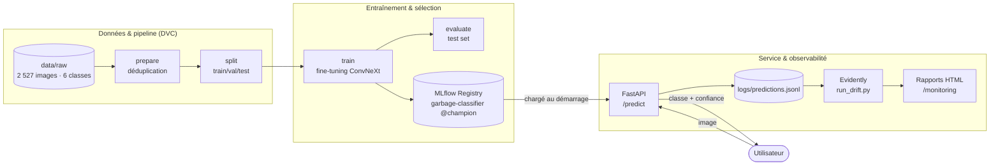

# WasteNet MLOps — Documentation d'architecture

**WasteNet** est un projet MLOps de **classification d'images de déchets** : à partir d'une
photo, le système prédit la catégorie du déchet parmi six classes
(**cardboard · glass · metal · paper · plastic · trash**).

Cette documentation décrit l'**architecture** du système (schémas) et **justifie les choix
techniques** (décisions d'architecture / ADR). Elle suit une structure inspirée d'[arc42](https://arc42.org/)
allégée et du [modèle C4](https://c4model.com/), avec des diagrammes [Mermaid](https://mermaid.js.org/).

!!! note "Démo en ligne"
    API déployée : <https://wastenet-mlops-prod.up.railway.app/> — documentation interactive
    Swagger sous `/docs`, dashboard de drift sous `/monitoring/`.

## Pile technique

| Domaine | Technologie |
|---|---|
| Modèle | PyTorch · timm (`convnext_tiny.in12k_ft_in1k`) |
| Pipeline & versioning données | DVC |
| Suivi d'expériences & registre | MLflow (hébergé sur DagsHub) |
| Optimisation d'hyperparamètres | Optuna (GridSampler) |
| Service d'inférence | FastAPI + Uvicorn |
| Conteneurisation & déploiement | Docker → Railway |
| Intégration & livraison continues | GitHub Actions : ruff · pytest · build + publication image (GHCR) |
| Monitoring de drift | Evidently AI (rapports HTML statiques) |

## Vue d'ensemble

## Le système en un coup d'œil

- **Tâche** : classification d'images, 6 classes, dataset
  [TrashNet / Garbage Classification (Kaggle)](https://www.kaggle.com/datasets/asdasdasasdas/garbage-classification),
  ~2 527 images après déduplication, splits train/val/test prédéfinis.
- **Modèle champion** : `convnext_tiny.in12k_ft_in1k` en `partial_finetune`,
  scheduler cosine + warmup. Performances (source de vérité : `metrics/`) :
  **val_acc = 98,17 %**, **test_acc = 95,35 %**, **test_F1 macro = 94,50 %** (early stop à 17 époques).
- **Reproductibilité** : tout le pipeline est piloté par `dvc repro` ; chaque expérience est
  tracée dans MLflow et le meilleur modèle est promu automatiquement via l'alias `@champion`.

## Comment lire cette doc

| Section | Contenu |
|---|---|
| [Contexte](context.md) | Périmètre, acteurs, systèmes externes (C4 niveau 1). |
| [Blocs de construction](building-blocks.md) | Conteneurs et composants internes (C4 niveau 2). |
| [Vue d'exécution](runtime.md) | Déroulé du pipeline DVC et de l'entraînement. |
| [Déploiement](deployment.md) | Infrastructure réelle (Railway + DagsHub), ports, CI. |
| [Monitoring](monitoring.md) | Détection de drift avec Evidently. |
| [Décisions (ADR)](decisions/index.md) | Justification de chaque choix technique majeur. |
