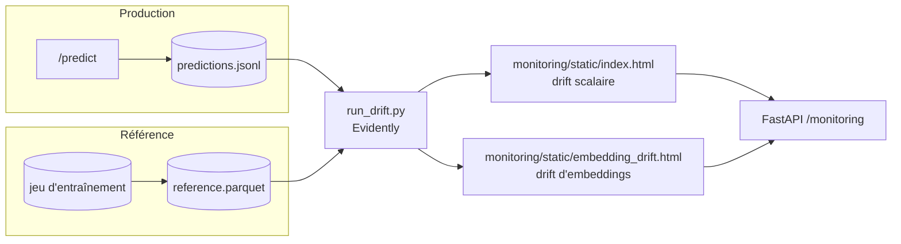

# Monitoring

> Détection de drift en production avec [Evidently AI](https://www.evidentlyai.com/).

## Principe

Chaque appel à `/predict` journalise une ligne dans `logs/predictions.jsonl` : classe prédite,
confiance, **embedding** du backbone et propriétés visuelles de l'image. Le script
`monitoring/run_drift.py` compare cette distribution de **production** à une distribution de
**référence** (le jeu d'entraînement, pré-calculé dans `reference.parquet`) et produit des
rapports de drift.



## Deux rapports

| Rapport | Méthode | Sortie |
|---|---|---|
| **Drift scalaire** | Test par colonne : χ² (classe prédite, catégoriel) et Kolmogorov–Smirnov (features numériques) | `monitoring/static/index.html` |
| **Drift d'embeddings** | Classifieur de domaine (*domain classifier*), seuil ROC-AUC **0,55** | `monitoring/static/embedding_drift.html` (généré si **≥ 20** prédictions) |

## Signaux suivis

| Signal | Type | Ce qu'il détecte |
|---|---|---|
| `predicted_class` | catégoriel | Dérive de la distribution des prédictions (concept drift). |
| `confidence` | numérique | Baisse de confiance du modèle. |
| `brightness` | numérique | Variation de luminosité des images entrantes. |
| `blur_score` | numérique | Variation de netteté (proxy variance du gradient). |
| `r_mean`, `g_mean`, `b_mean` | numérique | Dérive colorimétrique (covariate drift). |
| `emb_0…emb_n` | vecteur | Dérive de représentation détectée par le classifieur de domaine. |

## Service des rapports (Option A — statique)

En production, les rapports sont des **fichiers HTML autonomes** committés dans
`monitoring/static/` et servis par FastAPI (`StaticFiles`, `html=True`) sous `/monitoring`.
Une route `GET /monitoring` **documentée** (visible dans Swagger) redirige vers `/monitoring/`,
le `mount` `StaticFiles` étant lui-même absent de l'OpenAPI.
Il n'y a **pas** de serveur Evidently live (contraintes Railway : un seul port public et un
seul volume par service, et Evidently OSS gère mal un sous-chemin). → [ADR-0006](decisions/0006-evidently-drift-monitoring.md)

| URL | Contenu |
|---|---|
| `<domaine-api>/monitoring/` | Rapport de drift scalaire (`index.html`). |
| `<domaine-api>/monitoring/embedding_drift.html` | Rapport de drift d'embeddings. |

## Rafraîchir les rapports

C'est un **instantané**, pas un flux temps réel. Pour mettre à jour :

```bash
# 1. (prod) récupérer predictions.jsonl depuis le volume Railway
# 2. régénérer les rapports en local
poetry run python -m monitoring.run_drift
# 3. committer monitoring/static/*.html et pousser → redéploiement
```

En **développement local**, on peut aussi explorer le workspace Evidently de façon interactive :

```bash
poetry run evidently ui --workspace monitoring/workspace --port 8001
# → http://localhost:8001
```
