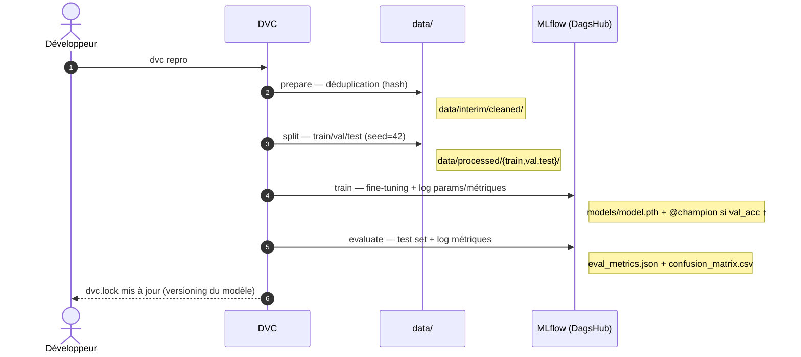
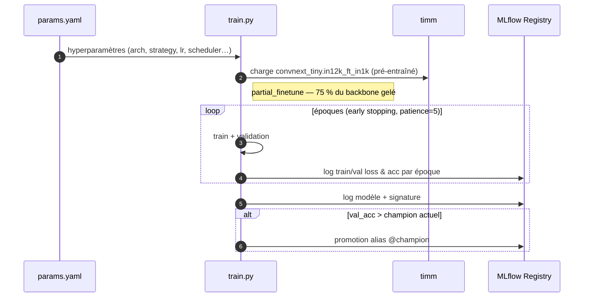

# Vue d'exécution

## Pipeline DVC

Tout le cycle données → modèle → évaluation est défini dans `dvc.yaml` et s'exécute via une
seule commande : `dvc repro`. DVC ne ré-exécute que les étapes dont les dépendances ont changé.

| Étape | Commande | Sortie principale |
|---|---|---|
| `prepare` | `dataset.py prepare` | `data/interim/cleaned/` |
| `split` | `dataset.py split` | `data/processed/{train,val,test}/` |
| `train` | `modeling/train.py` | `models/model.pth` + `metrics/train_metrics.json` |
| `evaluate` | `modeling/predict.py` | `metrics/eval_metrics.json` + `metrics/confusion_matrix.csv` |

## Flux d'entraînement (étape `train`)

### Hyperparamètres du champion (`params.yaml`)

| Paramètre | Valeur |
|---|---|
| `model_arch` | `convnext_tiny.in12k_ft_in1k` |
| `strategy` | `partial_finetune` (75 % du backbone gelé) |
| `lr` | `0.001` |
| `scheduler` | `cosine` (+ `warmup_epochs: 3`) |
| `epochs` / `batch_size` | `30` / `32` |
| `early_stopping_patience` | `5` |
| `split.seed` | `42` |

### Résultats du champion (`metrics/`)

| Métrique | Valeur | Fichier |
|---|---|---|
| `best_val_acc` | **98,17 %** | `train_metrics.json`, `tune_best.json` |
| `best_val_loss` | 0,0986 | `train_metrics.json` |
| `epochs_run` | 17 (early stop) | `train_metrics.json` |
| `test_acc` | **95,35 %** | `eval_metrics.json` |
| `test_f1_macro` | **94,50 %** | `eval_metrics.json` |

## Workflow d'expérimentation recommandé

L'ordre des opérations garantit la traçabilité (le hash git est capturé par MLflow) et la
reproductibilité (le modèle est versionné par `dvc.lock`) :

1. Éditer `params.yaml` (un seul hyperparamètre « scientifique » par expérience — voir
   [ADR-0008](decisions/0008-methodologie-tuning-incrementale.md)).
2. **Committer** `params.yaml` *avant* de lancer (capture le hash git dans MLflow).
3. **Lancer** `dvc repro` (et non `train.py` seul — garantit que `evaluate` tourne aussi).
4. **Committer** les résultats : `dvc.lock` + `metrics/` + `params.yaml`.
5. Suivre la progression dans l'UI MLflow / sur DagsHub.

!!! warning "Le `dvc.lock` est critique"
    Sans `dvc.lock` versionné dans git, les modèles ne sont plus reproductibles ni
    récupérables. Il doit toujours être committé avec les métriques.
